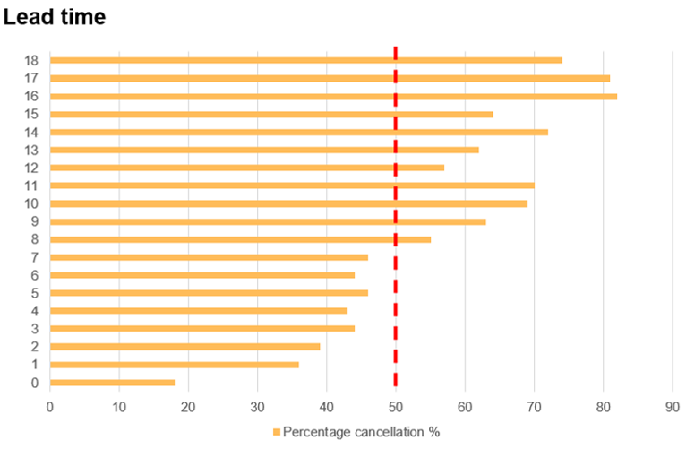
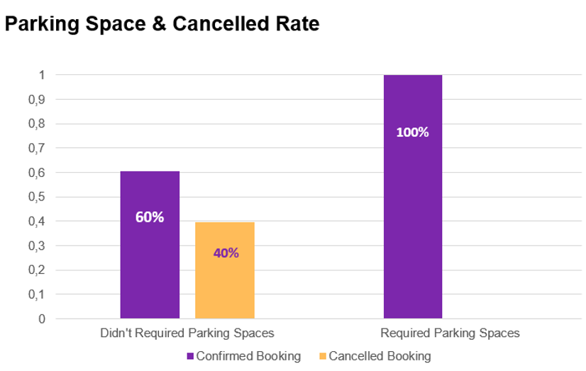
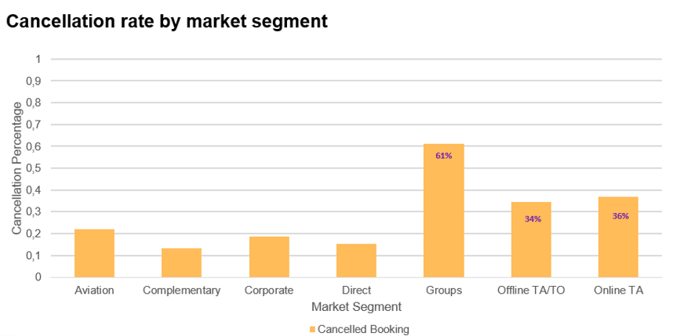
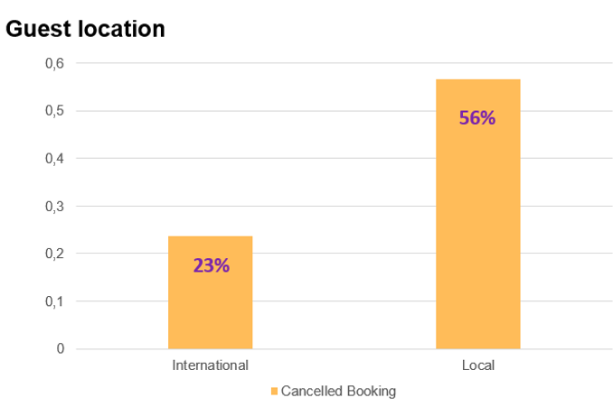
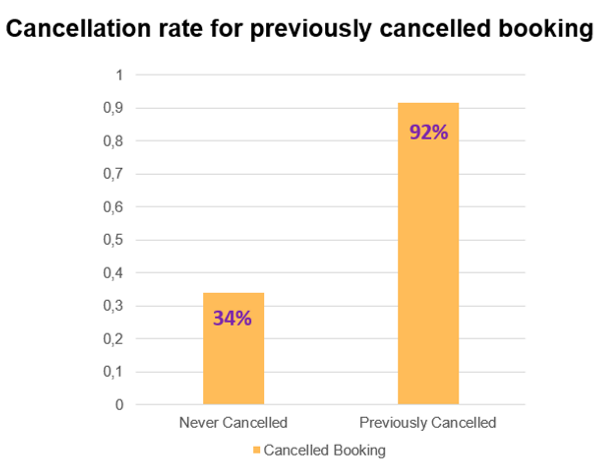
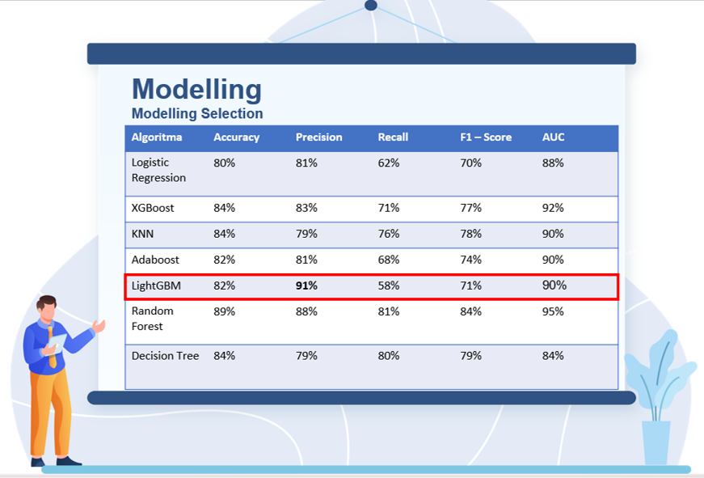
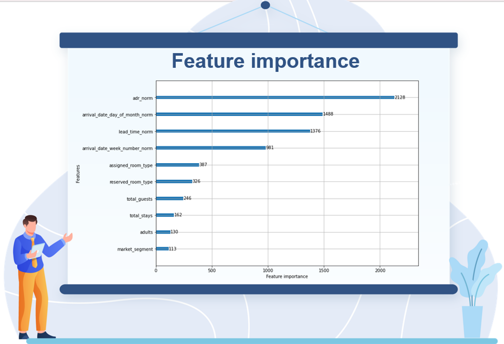
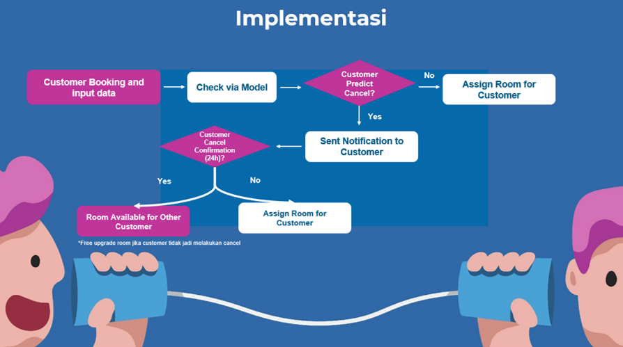
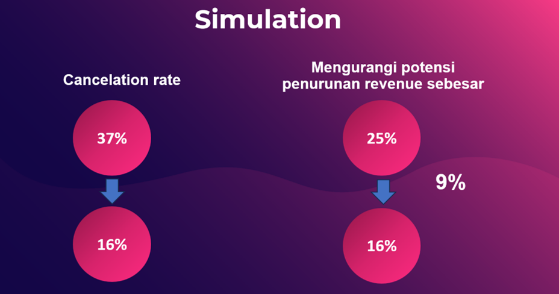

# Hotel-Booking-Cancellation-Prediction

Tool : Jupyter Notebook  
Programming Language : Python  
Visualization : Matplotlib, Seaborn  
Dataset : [Kaggle](https://www.kaggle.com/datasets/mojtaba142/hotel-booking)

---
# Introduction
Pemesanan hotel perlu dilakukan sebelum menginap di hotel. Jika hotel yang sudah dipesan dibatalkan oleh pemesan, maka akan menimbulkan :
1. **Kehilangan potensi pendapatan (revenue)** akibat meningkatnya kamar yang kosong akibat pembatalan pemesanan.
2. Jika dibiarkan akan menimbulkan **kebiasaan cancel** yang dapat mengakibatkan penurunan pendapatan.

Project ini menggunakan data pemesanan hotel (Resort Hotel dan City Hotel) yang ada di Portugal dengan tingkat pembatalan hotel mencapai 37%. Dengan menggunakan machine learning, akan dilakukan prediksi apakah suatu pemesanan hotel akan terdeteksi batal atau tidak.

# Goal
1. Membuat sebuah machine learning untuk memprediksi pembatalan dengan tujuan untuk mengurangi tingkat pembatalan dan meningkatkan pendapatan (revenue).
2. Mengetahui karakteristik pemesan hotel yang membatalkan pemesanan dan menemukan pola dalam pemesanan yang dibatalkan dengan melakukan exploratory data analysis.

---

# Overview
Dataset yang digunakan terdiri dari 119.390 baris dan 36 kolom.

# Exploratory Data Analysis

**1. Lead Time**

   

Pemesanan hotel dengan lead time lebih dari **7 bulan** memiliki peluang pembatalan lebih besar (>50%). **Semakin lama Lead time semakin tinggi kemungkinan pemesanan dibatalkan**.

**2. Parking Space & Cancelled Rate**

   

Pemesanan yang memerlukan tempat parkir tidak melakukan pembatalan pesanan.

**3. Cancellation rate by market segment**

   

Pembatalan tertinggi dilakukan oleh segmen pasar Group dengan pembatalan sebesar 61%, kemudian Online TA, dan yang ketiga Offline TA/TO.  
*Note: TA = Travel Agent, TO = Tour Operator*

**4. Guest location**

   

Pemesan turis lokal memiliki kemungkinan lebih tinggi untuk pembatalan pemesanan.

**5. Cancellation rate for previously cancelled booking**

   

Pemesan yang sebelumnya pernah melakukan pembatalan pemesanan, memiliki kemungkinan lebih tinggi untuk membatalkan pesanannya.

# Data Cleaning dan Preprocessing
**1. Handle Missing Value**
   Feature Company ---> Drop  
   Feature Agent ---> ada ID = 1, tidak ada = 0  
   Feature Country ---> Diisi dengan nilai modus  
   Feature Children ---> Hapus baris yang tidak memiliki value
**2. Handle Data Duplikat**
   Tidak ditemukan data yang duplikat.
**3. Handle Outlier**
- Mengubah outlier menjadi batas atas (High Limit).
- Ganti nilai outlier dari feature yang memiliki nilai low limit dan high limit yang sama, menjadi nilai terdekat.

# Feature Engineering
## Feature Transformation
- Normalisasi
- Categorical Encoding : Label Encoding dan One Hot Encoding
## Feature Extraction
- Total Stays = stays in weekend nights + stays in week nights
- Total Guest = adults + children + babies
- Kids = children + babies
- Guest Location = Value menjadi local and internasional
- Meal = Undifined diubah jadi SC (No Meal Package)
- Market Segment = Undifined diganti jadi nilai modus
## Feature Selection
Feature yang dihapus karena tidak digunakan : 
- Name
- Email
- Phone Number
- Credit Card
- Children
- Babies
- Stays in weekend nights
- Stays in week nights

# Modelling

   

Pada project ini dicoba beberapa algoritma dan didapatkan hasil precision yang paling baik adalah dengan **LightGBM** dengan hasil precision 91%.

# Feature Importance

   

Feature yang paling berpengaruh terhadap pembatalan pesanan adalah adr.
*Note : adr = average daily rate*

---

# Implementasi
Berikut gambaran / flowchart implementasi dari penggunaan machine learning untuk pemesanan hotel :

   

---

# Rekomendasi Bisnis
Berikut beberapa rekomendasi bisnis berdasarkan hasil analisa data : 
1. Kebijakan non-refund berlaku jika lead time > 210 hari
2. Menyediakan parkir VIP / Vallet
3. Penawaran spesial untuk pemesan/pengunjung lokal
4. Menyediakan/memberikan point loyalitas pengunjung/pemesan (Customer loyalty point)
5. Memberikan fasilitas berupa check in online
6. Memberikan notifikasi pengingat terkait pemesanan hotel melalui Whatsapp/email/sms
7. Menjalin kerjasama dengan hotel lain terkait ketersediaan kamar
8. Menjalin kerjasama dengan travel agent

---

# Simulasi

   

Dengan menggunakan algoritma machine learning yang sudah didapatkan, kemudian diaplikasikan ke data pemesanan hotel dan didapatkan tingkat pembatalan pemesanan dari 37% menjadi 16%. Hal ini tentu saja berkaitan erat dengan revenue, dimana awalnya potensi penurunan revenue sebesar 25% menjadi 16%.
